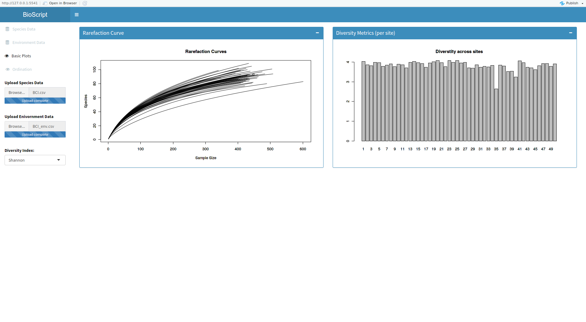
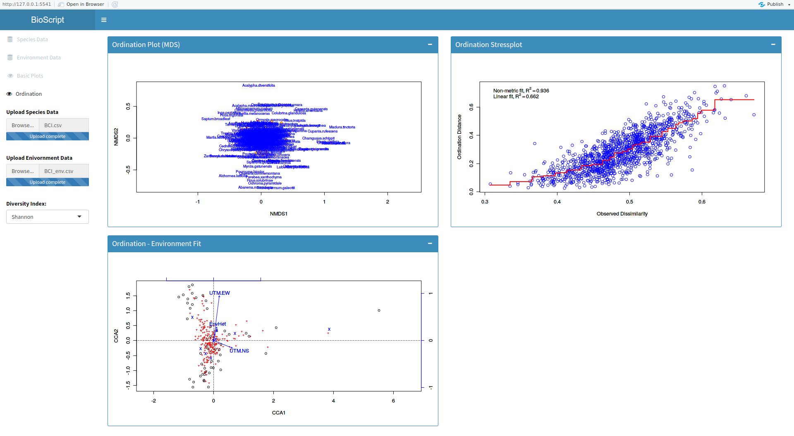
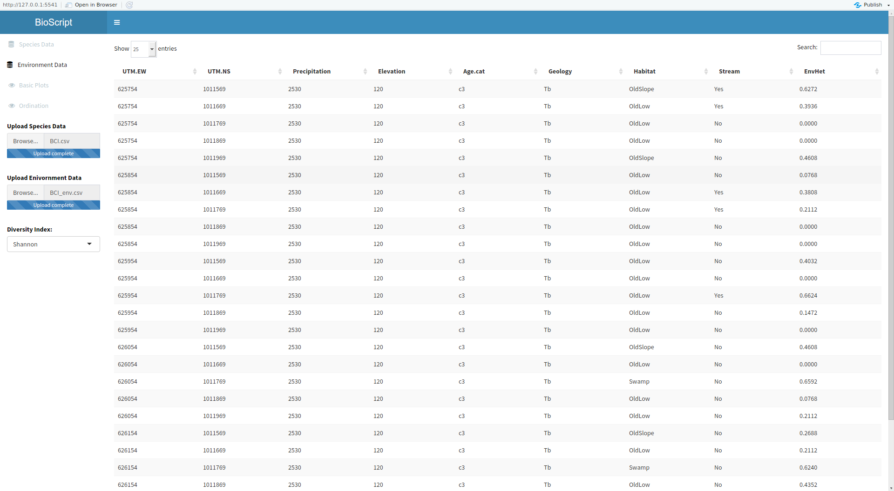

# Vegan GUI

This package a Graphical User Interface (GUI) for common community ecology functions from the [vegan]("https://cran.r-project.org/web/packages/vegan/index.html") package.

Screenshots: (click to zoom):

General Plots         |  Basic Ordination
:-------------------------:|:-------------------------:
 |  
 |  
